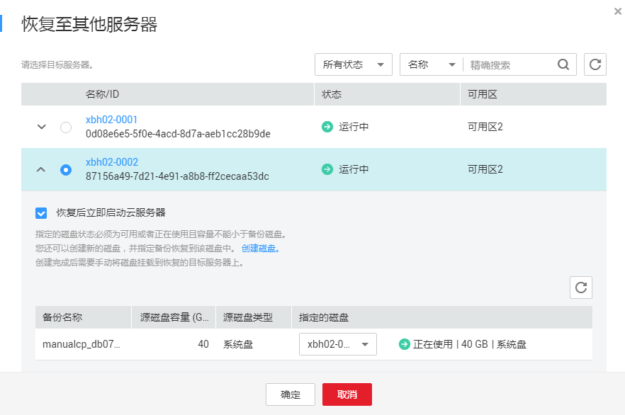

# 使用存储备份恢复数据

可以将云下服务器的备份恢复至云上其他的服务器中。

## 背景说明

-   同步至云端的备份无法创建服务器。
-   同步的备份只能用于恢复其他的云服务器，且只能恢复至数据盘。

## 操作步骤

1.  登录云备份管理控制台。
    1.  登录管理控制台。
    2.  单击管理控制台左上角的，选择区域和项目。
    3.  单击，选择“存储 \> 云备份 \> 混合云备份 \>存储备份”。

2.  选择“备份副本“页签，找到存储库和服务器所对应的备份，具体操作参见[查看备份](https://support.huaweicloud.com/usermanual-cbr/cbr_03_0013.html)。
3.  单击备份所在行的“恢复数据”，如[图1](#zh-cn_topic_0160754601_fig65211231152210)所示。

    **图 1**  存储备份恢复至其他服务器  
    

4.  可选：取消勾选“恢复后立即启动服务器”。

    如果取消勾选“恢复后立即启动服务器”，则恢复服务器操作执行完成后，需要手动启动服务器。

    > **须知：**   
    >恢复服务器的过程中会关闭服务器，请在业务空闲时操作。  

5.  在指定的磁盘下拉菜单中选择备份需要恢复到的磁盘。无法选择系统盘。

    > **说明：**   
    >-   如果服务器只有一个数据盘，则默认恢复到该磁盘。  
    >-   如果服务器只有一个系统盘，则需要创建新的磁盘才可以恢复。  
    >-   如果服务器存在多个磁盘，默认将备份恢复到原来的磁盘。也可以通过在“指定的磁盘“下拉菜单中重新选择磁盘的操作将备份恢复到备份服务器中的其他磁盘中。但是指定的磁盘容量不能小于之前的磁盘容量。  
    >-   备份的数据盘的数据，不能恢复到系统盘中。  

6.  单击“确定”，并确认备份恢复是否成功。

    您可以在备份列表中，查看备份恢复的执行状态。直到备份的“备份状态”恢复为“可用”，并且“任务状态“中没有新增失败的恢复任务时，表示恢复成功。

    查看恢复失败的任务请参见[处理任务](https://support.huaweicloud.com/usermanual-cbr/cbr_03_0035.html)。

