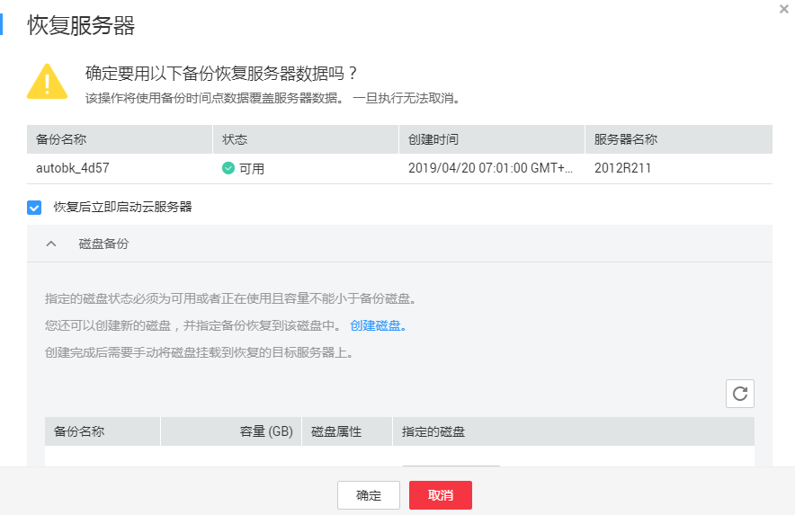

# 使用云服务器备份恢复数据

当服务器中的磁盘发生故障、或者由于人为误操作导致服务器数据丢失时，可以使用已经创建成功的备份恢复服务器。

## 背景信息

-   备份的数据盘的数据，不能恢复到系统盘中。
-   不支持恢复到状态处于“故障”的服务器。
-   不支持使用复制操作产生的备份用于恢复。

## 前提条件

-   需要恢复的服务器中的磁盘运行状态正常。
-   需要恢复的服务器至少存在一个备份，并且需要恢复的服务器的备份的“备份状态”为“可用”。

## 操作步骤

1.  登录云备份管理控制台。
    1.  登录管理控制台。
    2.  单击管理控制台左上角的，选择区域和项目。
    3.  选择“存储 \> 云备份”。选择对应备份的页签。

2.  选择“备份副本“页签，找到存储库和服务器所对应的备份，具体操作参见[查看备份](查看备份.md)。
3.  单击备份所在行的“恢复数据”，如[图1](#fig533382242914)所示。

    > **须知：**   
    >恢复服务器数据之后将导致备份时间点的数据覆盖服务器数据，一旦执行，无法回退。  

    **图 1**  恢复服务器  
    

4.  可选：取消勾选“恢复后立即启动服务器”。

    如果取消勾选“恢复后立即启动服务器”，则恢复服务器操作执行完成后，需要手动启动服务器。

    > **须知：**   
    >恢复服务器的过程中会关闭服务器，请在业务空闲时操作。  

5.  在指定的磁盘下拉菜单中选择备份需要恢复到的磁盘。

    > **说明：**   
    >-   如果服务器只有一个磁盘，则默认恢复到该磁盘。  
    >-   如果服务器存在多个磁盘，默认将备份恢复到原来的磁盘。也可以通过在“指定的磁盘“下拉菜单中重新选择磁盘的操作将备份恢复到备份服务器中的其他磁盘中。但是指定的磁盘容量不能小于之前的磁盘容量。  
    >-   备份的数据盘的数据，不能恢复到系统盘中。  

    > **须知：**   
    >如果当前恢复的服务器磁盘数量大于备份时刻的磁盘数量时，需要考虑数据的一致性问题，谨慎执行恢复操作。  
    >例如，Oracle应用的数据分散在被恢复及未被恢复的目标磁盘上，在恢复后可能导致数据不一致（被恢复的磁盘还原到历史数据，未被恢复的磁盘仍保留当前数据），甚至导致应用无法启动。  

6.  单击“确定”，并确认备份恢复是否成功。

    您可以在备份列表中，查看备份恢复的执行状态。直到备份的“备份状态”恢复为“可用”，并且“任务状态“中没有新增失败的恢复任务时，表示恢复成功。

    查看恢复失败的任务请参见[处理任务](处理任务.md)。

    > **须知：**   
    >当您恢复的服务器为Windows操作系统时，由于操作系统自身原因，恢复完成后可能无法显示数据盘。  
    >当您使用云服务器备份恢复逻辑卷组（LVM）时，恢复完成后需手动重新挂载。  
    >如果您遇到此情况，需要手动将数据盘置为联机状态。具体操作，请参见[Windows操作系统的服务器在恢复完成后未显示数据盘](https://support.huaweicloud.com/trouble-cbr/cbr_05_0002.html)。  

