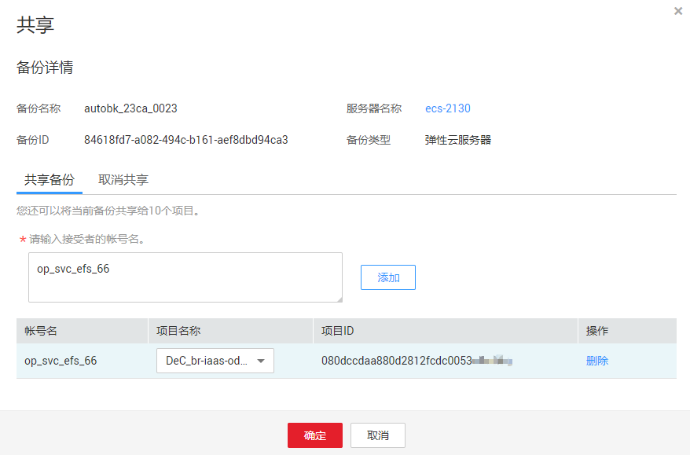
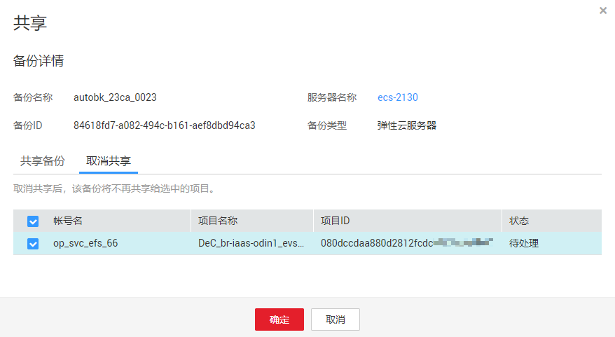

# 共享备份

在对服务器和磁盘数据进行备份后，可将备份进行添加共享，将备份共享给其他账户项目使用。共享的备份可用于创建服务器等操作。

## 背景说明

* 仅支持共享云服务器备份。仅支持在同一区域的不同用户间共享。

* 共享备份接收方可以选择是否接收备份，接收备份后可将备份用于创建新的服务器。

* 加密备份无法共享。共享的目标项目应与被共享的备份位于同一区域，暂不支持跨区域共享。

## 操作步骤

1.  登录云备份管理控制台。
    1.  登录管理控制台。
    2.  单击管理控制台左上角的，选择区域和项目。
    3.  选择“存储 \> 云备份”。选择对应备份的页签。

2.  在云服务器备份页面，选择“备份副本“页签，通过筛选条件查看备份。
3.  单击目标备份“操作”列下的“更多 \> 共享”，打开共享页面。

    展开的页面显示了该备份的备份名称、服务器名称、备份ID和备份类型。

    -   添加共享

        **图 1**  共享备份  
        

    1.  选择“共享备份”页签。
    2.  在输入框中输入待共享目标用户的帐号名。
    3.  单击对话框中的“添加“，待添加的帐号和项目会出现在列表中。可以继续添加帐号。可以将备份共享给10个项目。
    4.  单击“确定“，完成共享添加。

    -   取消共享

    1.  选择目标备份，单击“操作”列下的“更多 \> 共享”。
    2.  选择“取消共享”页签，在弹出的对话框中确认需要删除的共享项目信息，勾选不再需要共享的备份，单击“确定”。如[图2](#fig89741507017)所示。

        **图 2**  取消共享  
        

