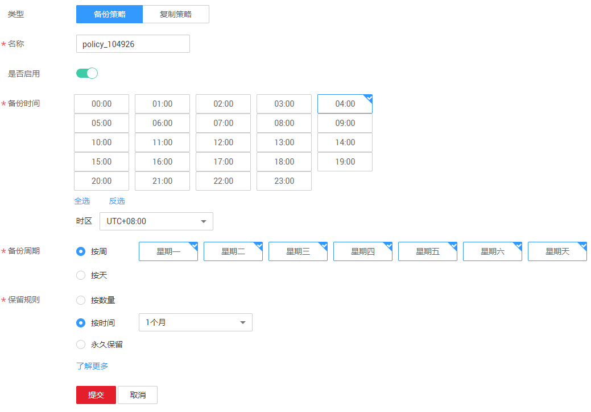

# 创建存储库备份策略

通过备份策略，您可以将整个存储库绑定的资源按照一定的策略要求，对资源的数据进行周期性备份，以便服务器在数据丢失或损坏时快速恢复数据，保证业务正常运行。

当需要定期备份存储库时，首先需要创建一个备份策略，系统根据您的备份策略决定何时执行备份任务。您可以使用系统提供的默认备份策略，也可以结合实际情况，创建新的自定义备份策略。

可以为云服务器备份存储库和云硬盘备份存储库设置备份策略。

## 背景信息

-   通过备份策略的方式对资源进行周期性备份，仅当启用备份策略后，系统才会自动备份所绑定的存储库绑定的资源，并定期删除过期的备份。
-   每个用户最多只能创建32个备份策略。
-   设置备份时间和复制备份的时间时，尽量在确保备份策略执行完毕备份任务已完成后再执行复制策略，否则可能会出现复制备份失败的情况。
-   删除过期自动备份数据不会删除手动备份数据。

## 操作步骤

1.  登录云备份管理控制台。
    1.  登录管理控制台。
    2.  单击管理控制台左上角的，选择区域和项目。
    3.  单击，选择“存储 \> 云备份  \> 策略”。

2.  选择“备份策略”页签，单击右上角“创建策略”，创建自定义策略。如[图1](#fig83663164139)所示。

    **图 1**  创建备份策略  
    

3.  设置备份策略信息。各参数说明如[表1](#table18975142115146)所示。

    **表 1**  备份策略参数说明

    
    <table><thead align="left"><tr id="row1997514210149"><th class="cellrowborder" valign="top" width="16.161616161616163%" id="mcps1.2.4.1.1">
参数

    </th>
    <th class="cellrowborder" valign="top" width="50.505050505050505%" id="mcps1.2.4.1.2">
说明

    </th>
    <th class="cellrowborder" valign="top" width="33.333333333333336%" id="mcps1.2.4.1.3">
备注

    </th>
    </tr>
    </thead>
    <tbody><tr id="row1084012355149"><td class="cellrowborder" valign="top" width="16.161616161616163%" headers="mcps1.2.4.1.1 ">
类型

    </td>
    <td class="cellrowborder" valign="top" width="50.505050505050505%" headers="mcps1.2.4.1.2 ">
选择策略类型。本章节以创建备份策略为例。

    </td>
    <td class="cellrowborder" valign="top" width="33.333333333333336%" headers="mcps1.2.4.1.3 ">
备份策略

    </td>
    </tr>
    <tr id="row4976122191416"><td class="cellrowborder" valign="top" width="16.161616161616163%" headers="mcps1.2.4.1.1 ">
名称

    </td>
    <td class="cellrowborder" valign="top" width="50.505050505050505%" headers="mcps1.2.4.1.2 ">
设置备份策略的名称。

    
只能由中文字符、英文字母、数字、下划线、中划线组成，且长度小于等于64个字符。

    </td>
    <td class="cellrowborder" valign="top" width="33.333333333333336%" headers="mcps1.2.4.1.3 ">
backup_policy

    </td>
    </tr>
    <tr id="row1248223165716"><td class="cellrowborder" valign="top" width="16.161616161616163%" headers="mcps1.2.4.1.1 ">
是否启用

    </td>
    <td class="cellrowborder" valign="top" width="50.505050505050505%" headers="mcps1.2.4.1.2 ">
设置备份策略的启用状态。

    <ul id="ul14659163365820"><li>启用：</li><li>禁用：</li></ul>
    </td>
    <td class="cellrowborder" valign="top" width="33.333333333333336%" headers="mcps1.2.4.1.3 ">
仅当启用备份策略后，系统才会自动备份所绑定的存储库的服务器和磁盘，并定期删除过期的备份。

    </td>
    </tr>
    <tr id="row1631531981516"><td class="cellrowborder" valign="top" width="16.161616161616163%" headers="mcps1.2.4.1.1 ">
备份时间

    </td>
    <td class="cellrowborder" valign="top" width="50.505050505050505%" headers="mcps1.2.4.1.2 ">
设置备份任务在一天之内的执行时间点。

    
只支持在整点进行备份，同时支持选择多个整点进行备份。

    </td>
    <td class="cellrowborder" valign="top" width="33.333333333333336%" headers="mcps1.2.4.1.3 ">
00:00，02:00

    
建议选择无业务或者业务量较少的时间进行备份。

    </td>
    </tr>
    <tr id="row8447021201515"><td class="cellrowborder" valign="top" width="16.161616161616163%" headers="mcps1.2.4.1.1 ">
备份周期

    </td>
    <td class="cellrowborder" valign="top" width="50.505050505050505%" headers="mcps1.2.4.1.2 ">
设置备份任务的执行日期。

    <ul id="ul172457131819"><li>按周
指定备份策略在每周的周几进行备份，可以多选。

    </li><li>按天
指定备份策略每隔几天进行一次备份，可设置1～30天。

    </li></ul>
    </td>
    <td class="cellrowborder" valign="top" width="33.333333333333336%" headers="mcps1.2.4.1.3 ">
每1天

    
当选择按天备份时，理论上第一次备份的时间为备份策略创建当天。如果当天备份策略创建的时间已经晚于设置的备份时间，那么将会等到第二个备份周期再进行第一次备份。

    
建议选择无业务或者业务量较少的时间进行备份。

    </td>
    </tr>
    <tr id="row9482950131718"><td class="cellrowborder" valign="top" width="16.161616161616163%" headers="mcps1.2.4.1.1 ">
保留规则

    </td>
    <td class="cellrowborder" valign="top" width="50.505050505050505%" headers="mcps1.2.4.1.2 ">
设置备份产生后的保留规则。

    <ul id="ul1544815182330"><li>按时间
可选择1个月、3个月、6个月、1年的固定保留时长或根据需要自定义保留时长。取值范围为1～99999天。

    </li><li>按数量
单个云服务器执行备份策略保留的备份总份数。取值范围为1～99999个。

    
同时你还可以设置长期保留规则，且长期保留配置与按数量保留之间没有相互影响，共同有效：

    <ul id="ul143454010416"><li>保留日备份：取值范围为0-100。</li><li>保留周备份：取值范围为0-100。</li><li>保留月备份：取值范围为0-100。</li><li>保留年备份：取值范围为0-100。</li></ul>
    
例如：日备份，即系统会每天保留最新的一份备份。在本日内，对磁盘进行多次备份后，则只会取本日最后一个备份进行保留。若选择保留5个日备份，则会选取最新的5个日备份进行保留。超过5个后，系统会自动删除最老的备份。同时设置日备份、周备份、月备份和年备份，则会取交集备份进行保留。长期保留规则与按数量保留可以同时执行，不会产生冲突。

    </li><li>永久保留
 说明： 
<ul id="ul513693919476"><li>当保留的备份数超过设置的数值时，系统会自动删除最早创建的备份，当保留的备份超过设定的时间时，系统会自动删除所有过期的备份；系统默认每隔一天自动清理，删除的备份不会影响其他备份用于恢复。</li><li>保留规则仅对备份策略自动调度生成的备份有效。手动执行备份策略生成的备份不会统计在内，且不会自动删除。如需删除，请在备份页签的备份列表中手动删除。</li><li>当备份创建过镜像之后，该备份不会继续统计在保留规则中，也不会自动删除。</li><li>周期性备份产生的失败的备份最多保留10个，保留时长1个月，可手动删除。</li></ul>
    

    </li></ul>
    </td>
    <td class="cellrowborder" valign="top" width="33.333333333333336%" headers="mcps1.2.4.1.3 ">
6个月

    </td>
    </tr>
    </tbody>
    </table>

    > **说明：**   
    >备份越频繁，保留的备份份数越多或时间越长，对数据的保护越充分，但是占用的存储库空间也越大。请根据数据的重要级别和业务量综合考虑选择，重要的数据采用较短的备份周期，且保留较多的备份份数或较长时间。  

4.  设置完成后，单击“提交”，完成备份策略的创建。
5.  找到目标存储库，单击“更多 \> 设置备份策略”，绑定创建好的备份策略。可以在存储库详情中查看已配置的备份策略。

    绑定成功后，存储库将按照备份策略进行周期性备份。

