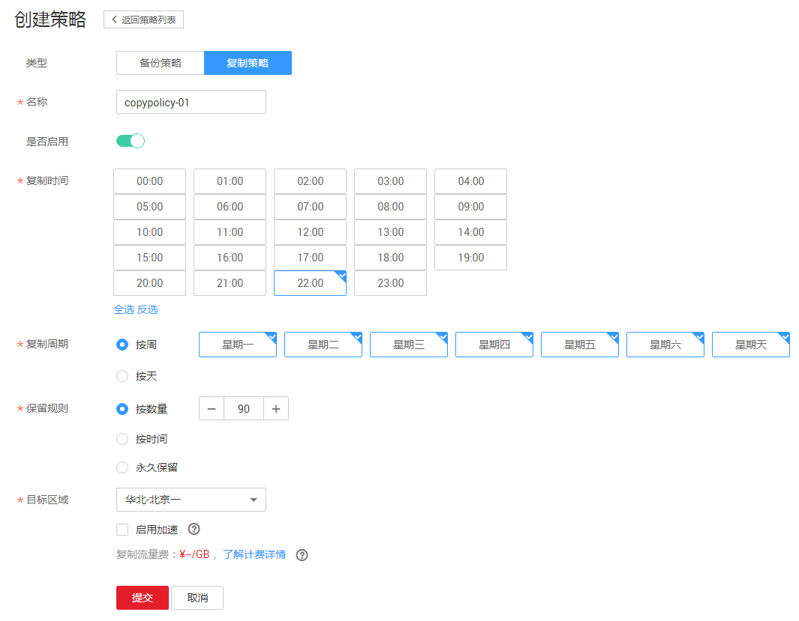

# 创建存储库复制策略

您可以配置复制策略，周期性的对策略产生的未向目标区域进行过复制或复制失败的备份执行复制操作。

可以为云服务器备份存储库和混合云备份存储库设置复制策略。

## 背景信息

设置备份时间和复制备份的时间时，尽量在确保备份策略执行完毕备份任务已完成后再执行复制策略，否则可能会出现复制备份失败的情况。

## 操作步骤

1.  登录云备份管理控制台。
    1.  登录管理控制台。
    2.  单击管理控制台左上角的，选择区域和项目。
    3.  选择“存储 \> 云备份”。选择对应备份的页签。

2.  选择“复制策略”页签，单击右上角“创建策略”，创建自定义策略。如[图1](#fig1610315463012)所示。

    **图 1**  创建复制策略  
    

3.  设置复制策略信息。各参数说明如[表1](#table18975142115146)所示。

    **表 1**  复制策略参数说明

    
    <table><thead align="left"><tr id="row1997514210149"><th class="cellrowborder" valign="top" width="16.161616161616163%" id="mcps1.2.4.1.1">
参数

    </th>
    <th class="cellrowborder" valign="top" width="50.505050505050505%" id="mcps1.2.4.1.2">
说明

    </th>
    <th class="cellrowborder" valign="top" width="33.333333333333336%" id="mcps1.2.4.1.3">
备注

    </th>
    </tr>
    </thead>
    <tbody><tr id="row1084012355149"><td class="cellrowborder" valign="top" width="16.161616161616163%" headers="mcps1.2.4.1.1 ">
类型

    </td>
    <td class="cellrowborder" valign="top" width="50.505050505050505%" headers="mcps1.2.4.1.2 ">
选择策略类型。本章节以创建复制策略为例。

    </td>
    <td class="cellrowborder" valign="top" width="33.333333333333336%" headers="mcps1.2.4.1.3 ">
复制策略

    </td>
    </tr>
    <tr id="row4976122191416"><td class="cellrowborder" valign="top" width="16.161616161616163%" headers="mcps1.2.4.1.1 ">
名称

    </td>
    <td class="cellrowborder" valign="top" width="50.505050505050505%" headers="mcps1.2.4.1.2 ">
设置复制策略的名称。

    
只能由中文字符、英文字母、数字、下划线、中划线组成，且长度小于等于64个字符。

    </td>
    <td class="cellrowborder" valign="top" width="33.333333333333336%" headers="mcps1.2.4.1.3 ">
replication_policy

    </td>
    </tr>
    <tr id="row1248223165716"><td class="cellrowborder" valign="top" width="16.161616161616163%" headers="mcps1.2.4.1.1 ">
是否启用

    </td>
    <td class="cellrowborder" valign="top" width="50.505050505050505%" headers="mcps1.2.4.1.2 ">
设置复制策略的启用状态。

    <ul id="ul14659163365820"><li>启用：</li><li>禁用：</li></ul>
    </td>
    <td class="cellrowborder" valign="top" width="33.333333333333336%" headers="mcps1.2.4.1.3 ">
仅当启用复制策略后，系统才会自动复制所绑定的存储库的服务器数据，并定期删除过期的备份。

    </td>
    </tr>
    <tr id="row1631531981516"><td class="cellrowborder" valign="top" width="16.161616161616163%" headers="mcps1.2.4.1.1 ">
复制时间

    </td>
    <td class="cellrowborder" valign="top" width="50.505050505050505%" headers="mcps1.2.4.1.2 ">
设置复制任务在一天之内的执行时间点。

    
只支持在整点进行复制，同时支持选择多个整点进行复制。

    </td>
    <td class="cellrowborder" valign="top" width="33.333333333333336%" headers="mcps1.2.4.1.3 ">
00:00，02:00

    
建议选择无业务或者业务量较少的时间进行复制。

    </td>
    </tr>
    <tr id="row8447021201515"><td class="cellrowborder" valign="top" width="16.161616161616163%" headers="mcps1.2.4.1.1 ">
复制周期

    </td>
    <td class="cellrowborder" valign="top" width="50.505050505050505%" headers="mcps1.2.4.1.2 ">
设置复制任务的执行日期。

    <ul id="ul156377273810"><li>按周
指定复制策略在每周的周几执行，可以多选。

    </li><li>按天
指定复制策略每隔几天执行一次，可设置1～30天。

    </li></ul>
    </td>
    <td class="cellrowborder" valign="top" width="33.333333333333336%" headers="mcps1.2.4.1.3 ">
每1天

    
当选择按天复制时，理论上第一次复制的时间为复制策略创建当天。如果当天复制策略创建的时间已经晚于设置的复制时间，那么将会等到第二个复制周期再进行第一次复制。

    </td>
    </tr>
    <tr id="row9482950131718"><td class="cellrowborder" valign="top" width="16.161616161616163%" headers="mcps1.2.4.1.1 ">
保留规则

    </td>
    <td class="cellrowborder" valign="top" width="50.505050505050505%" headers="mcps1.2.4.1.2 ">
设置复制到目标区域的目标备份的保留规则。

    <ul id="ul196551027184"><li>按时间
可选择1个月、3个月、6个月、1年的固定保留时长或根据需要自定义保留时长。取值范围为1～99999天。

    </li><li>按数量
单个云服务器保留的复制总份数。取值范围为1～99999个。

    </li><li>永久保留
 说明： 
<ul id="ul116661273815"><li>当保留的复制数超过设置的数值时，系统会自动删除最早创建的复制，当保留的复制超过设定的时间时，系统会自动删除所有过期的复制；系统默认每隔一天自动清理。</li><li>保留规则仅对复制策略自动调度生成的复制有效。手动执行复制策略生成的复制不会统计在内，且不会自动删除。如需删除，请在目标区域备份页签的备份列表中手动删除。</li><li>当复制创建过镜像之后，该复制不会继续统计在保留规则中，也不会自动删除。</li></ul>
    

    </li></ul>
    </td>
    <td class="cellrowborder" valign="top" width="33.333333333333336%" headers="mcps1.2.4.1.3 ">
6个月

    </td>
    </tr>
    <tr id="row46551950103514"><td class="cellrowborder" valign="top" width="16.161616161616163%" headers="mcps1.2.4.1.1 ">
目标区域

    </td>
    <td class="cellrowborder" valign="top" width="50.505050505050505%" headers="mcps1.2.4.1.2 ">
选择备份数据需要复制到的目标区域。

    
只有具备复制能力的区域才会在目标区域中展示。

    <ul id="ul649081582612"><li>如果所选区域只有一个项目，则直接选择区域名称即可。</li><li>如果所选区域有多个项目，默认选择该区域下的主项目，也可以根据需要选择其他项目。</li></ul>
    </td>
    <td class="cellrowborder" valign="top" width="33.333333333333336%" headers="mcps1.2.4.1.3 ">
华北-北京一

    </td>
    </tr>
    <tr id="row5964204193616"><td class="cellrowborder" valign="top" width="16.161616161616163%" headers="mcps1.2.4.1.1 ">
启用加速

    </td>
    <td class="cellrowborder" valign="top" width="50.505050505050505%" headers="mcps1.2.4.1.2 ">
启用加速后，备份数据将更快地复制到目标区域。

    
启用加速需要收取额外的流量费用。

    </td>
    <td class="cellrowborder" valign="top" width="33.333333333333336%" headers="mcps1.2.4.1.3 ">
-

    </td>
    </tr>
    </tbody>
    </table>

4.  设置完成后，单击“确定”，完成复制策略的创建。
5.  找到目标存储库，单击“更多 \> 设置复制策略”，绑定创建好的复制策略。可以在存储库详情中查看已配置的复制策略。

    绑定成功后，存储库将按照复制策略进行周期性复制。

