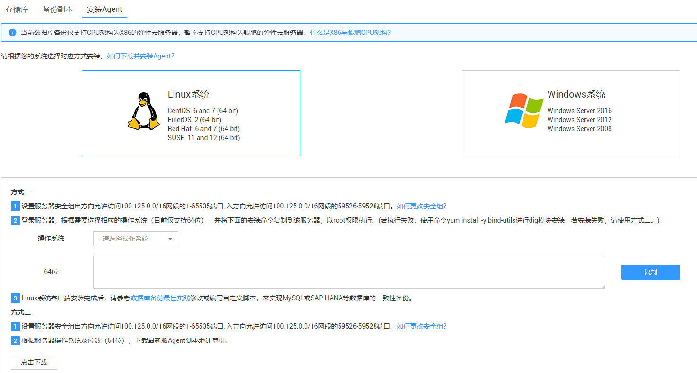
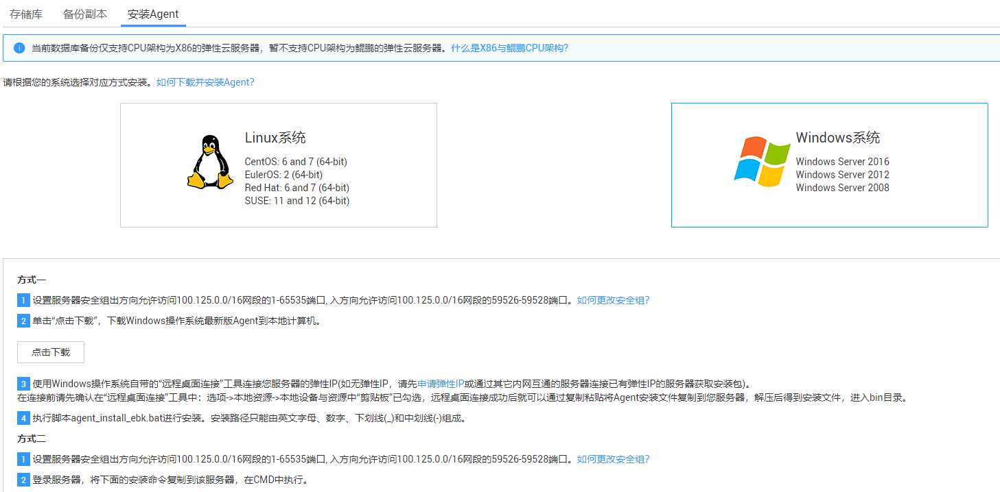
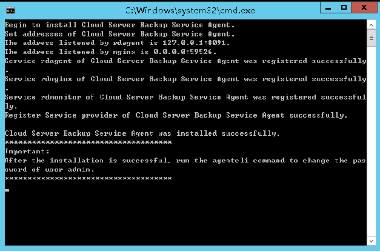

# 安装Agent

## 操作说明

-   用户需要启用数据库备份前，需先在弹性云服务器上更改安全组和安装客户端。本章节指导用户下载并安装客户端。
-   安装客户端时，系统会以“rdadmin”用户运行安装程序。请定期修改Agent的操作系统“rdadmin”用户的登录密码，并禁止“rdadmin”用户远程登录，以提升系统运维安全性。详情请参见[修改rdadmin帐号密码](修改rdadmin帐号密码.md)。
-   支持安装客户端的操作系统如[表1](#table1997917214406)所示。

    **表 1**  支持安装客户端的操作系统列表

    
    <table><thead align="left"><tr id="row17963824406"><th class="cellrowborder" valign="top" width="19%" id="mcps1.2.4.1.1">
数据库名称

    </th>
    <th class="cellrowborder" valign="top" width="16%" id="mcps1.2.4.1.2">
操作系统类型

    </th>
    <th class="cellrowborder" valign="top" width="65%" id="mcps1.2.4.1.3">
版本范围

    </th>
    </tr>
    </thead>
    <tbody><tr id="row89794274012"><td class="cellrowborder" valign="top" width="19%" headers="mcps1.2.4.1.1 ">
SQLServer 2008/2012

    </td>
    <td class="cellrowborder" valign="top" width="16%" headers="mcps1.2.4.1.2 ">
Windows

    </td>
    <td class="cellrowborder" valign="top" width="65%" headers="mcps1.2.4.1.3 ">
Windows Server 2008, 2008 r2, 2012 , 2012 r2 for x86_64

    </td>
    </tr>
    <tr id="row129799211400"><td class="cellrowborder" valign="top" width="19%" headers="mcps1.2.4.1.1 ">
SQLServer 2014/2016/EE

    </td>
    <td class="cellrowborder" valign="top" width="16%" headers="mcps1.2.4.1.2 ">
Windows

    </td>
    <td class="cellrowborder" valign="top" width="65%" headers="mcps1.2.4.1.3 ">
Windows Server 2012, 2012 r2, 2016 Datacenter for x86_64

    </td>
    </tr>
    <tr id="row397920294015"><td class="cellrowborder" rowspan="4" valign="top" width="19%" headers="mcps1.2.4.1.1 ">
MySQL 5.5/5.6/5.7

    </td>
    <td class="cellrowborder" valign="top" width="16%" headers="mcps1.2.4.1.2 ">
Red Hat

    </td>
    <td class="cellrowborder" valign="top" width="65%" headers="mcps1.2.4.1.3 ">
Red Hat Enterprise Linux 6, 7 for x86_64

    </td>
    </tr>
    <tr id="row189792264012"><td class="cellrowborder" valign="top" headers="mcps1.2.4.1.1 ">
SUSE

    </td>
    <td class="cellrowborder" valign="top" headers="mcps1.2.4.1.2 ">
SUSE Linux Enterprise Server 11, 12 for x86_64

    </td>
    </tr>
    <tr id="row097919254017"><td class="cellrowborder" valign="top" headers="mcps1.2.4.1.1 ">
CentOS

    </td>
    <td class="cellrowborder" valign="top" headers="mcps1.2.4.1.2 ">
CentOS 6, 7 for x86_64

    </td>
    </tr>
    <tr id="row197918220402"><td class="cellrowborder" valign="top" headers="mcps1.2.4.1.1 ">
Euler

    </td>
    <td class="cellrowborder" valign="top" headers="mcps1.2.4.1.2 ">
Euler OS 2.2, 2.3 for x86_64

    </td>
    </tr>
    <tr id="row18979422401"><td class="cellrowborder" valign="top" width="19%" headers="mcps1.2.4.1.1 ">
HANA 1.0/2.0

    </td>
    <td class="cellrowborder" valign="top" width="16%" headers="mcps1.2.4.1.2 ">
SUSE

    </td>
    <td class="cellrowborder" valign="top" width="65%" headers="mcps1.2.4.1.3 ">
SUSE Linux Enterprise Server 12 for x86_64

    </td>
    </tr>
    </tbody>
    </table>

> **须知：**   
>客户端安装时，系统会打开弹性云服务器的59526-59528端口的防火墙其中之一。当59526端口被占用时，则会打开59527端口的防火墙，以此类推。  

## 前提条件

-   已获取管理控制台的登录帐号与密码。
-   已经配置好安全组。
-   弹性云服务器的“Agent状态”为“未安装”。
-   通过IE浏览器访问时需要将用到的网站加入受信任的站点。

## 安装Linux版本客户端（方式一）

1.  登录云备份管理控制台。
    1.  登录管理控制台。
    2.  单击管理控制台左上角的，选择区域和项目。
    3.  选择“存储 \> 云备份”。选择对应备份的页签。

2.  选择“安装Agent“页签，进入“安装Agent”页面。

    **图 1**  进入Linux安装界面  
    

3.  在方式一中，根据需要选择相应的Agent版本，并将步骤二的安装命令复制下来。
4.  前往“弹性云服务器”界面，选择目标服务器，单击“操作”列下的“远程登录”，登录该弹性云服务器。
5.  将步骤二的安装命令粘贴至该服务器，以root权限执行。若执行失败，请使用命令yum install -y bind-utils进行dig模块安装。
6.  根据系统提示，完成安装。若安装失败，请使用方式二。
7.  Linux系统客户端安装完成后，请参考数据库备份最佳实践修改或编写自定义脚本，来实现MySQL或SAP HANA等数据库的一致性备份。

## 安装Linux版本客户端（方式二）

1.  登录云备份管理控制台。
    1.  登录管理控制台。
    2.  单击管理控制台左上角的，选择区域和项目。
    3.  选择“存储 \> 云备份”。选择对应备份的页签。

2.  选择“安装Agent“页签，进入“安装Agent”页面。

    **图 2**  Linux安装界面  
    

3.  在方式二中，单击“点击下载“。在弹出的“下载客户端“，根据目标弹性云服务器的操作系统类型，选择需要下载的版本，单击“确定“。如[图3](#fig1827319471211)所示。

    **图 3**  下载客户端  
    

4.  将客户端下载至本地任意目录后，使用文件传输工具（例如：“Xftp”、“SecureFX”、“WinSCP”），将下载的客户端安装包上传到待安装客户端的弹性云服务器。
5.  上传完毕后，前往“弹性云服务器”界面，选择目标服务器，单击“操作”列下的“远程登录”，登录该弹性云服务器。
6.  执行**tar -zxvf**命令，将客户端安装包解压至任意目录，执行以下命令，进入解压后目录中的bin目录。

    **cd** _安装包所在目录_

7.  执行以下命令，运行安装脚本。

    **sh agent\_install\_ebk.sh**

8.  系统提示客户端安装成功，如[图4](#fig98742261182)所示。

    **图 4**  安装Linux客户端成功  
    

9.  若弹性云服务器中已经安装了MySQL或SAP HANA数据库，需要执行以下命令加密MySQL或HANA数据库登录密码。

    **/home/rdadmin/Agent/bin/agentcli encpwd**

10. 使用[步骤9](#li1857075115439)中的加密密码替换/home/rdadmin/Agent/bin/thirdparty/ebk\_user/目录下脚本里的数据库登录密码。
11. Linux系统客户端安装完成后，请参考数据库备份最佳实践修改或编写自定义脚本，来实现MySQL或SAP HANA等数据库的一致性备份。

## 安装Windows版本客户端（方式一）

1.  登录云备份管理控制台。
    1.  登录管理控制台。
    2.  单击管理控制台左上角的，选择区域和项目。
    3.  选择“存储 \> 云备份”。选择对应备份的页签。

2.  选择“安装Agent“页签，进入“安装Agent”页面。

    **图 5**  进入Windows安装界面  
    

3.  在方式一中，单击“点击下载“。将下载的安装包保存至本地任意目录。
4.  将客户端下载至本地任意目录后，使用文件传输工具（例如：“Xftp”、“SecureFX”、“WinSCP”），将下载的客户端安装包上传到待安装客户端的弹性云服务器。
5.  登录控制台，以Administrator的权限进入弹性云服务器。
6.  将安装包解压至任意目录，进入“_安装路径_**\\bin**”目录中。
7.  双击**agent\_install\_ebk.bat**脚本开始安装。
8.  系统提示客户端安装成功，如[图6](#fig15516539536)所示。

    **图 6**  Windows客户端安装成功  
    

## 安装Windows版本客户端（方式二）

1.  登录云备份管理控制台。
    1.  登录管理控制台。
    2.  单击管理控制台左上角的，选择区域和项目。
    3.  选择“存储 \> 云备份”。选择对应备份的页签。

2.  选择“安装Agent“页签，进入“安装Agent”页面。

    **图 7**  Windows安装界面  
    

3.  前往“弹性云服务器”界面，选择目标服务器，单击“操作”列下的“远程登录”，以Administrator的权限登录该弹性云服务器。
4.  将方式二步骤二框中的安装命令复制到该服务器，在CMD中执行。
5.  将应答名称中的任一IP地址复制下来，在浏览器地址中粘贴，并替换下面的0.0.0.0，**_cn-north-1_**需要根据实际区域进行替换，此处以华北区为例。然后在浏览器中按“Enter”下载安装包。

    **http://_0.0.0.0_/csbs-agent-**_cn-north-1_**/Cloud Server Backup Agent-WIN64.zip**

6.  解压后得到安装文件。将安装包解压至任意目录，进入“_安装路径_**\\bin**”目录中。
7.  双击**agent\_install\_ebk.bat**脚本开始安装。
8.  系统提示客户端安装成功，如[图8](#fig7765912171519)所示。

    **图 8**  安装Windows客户端成功  
    

