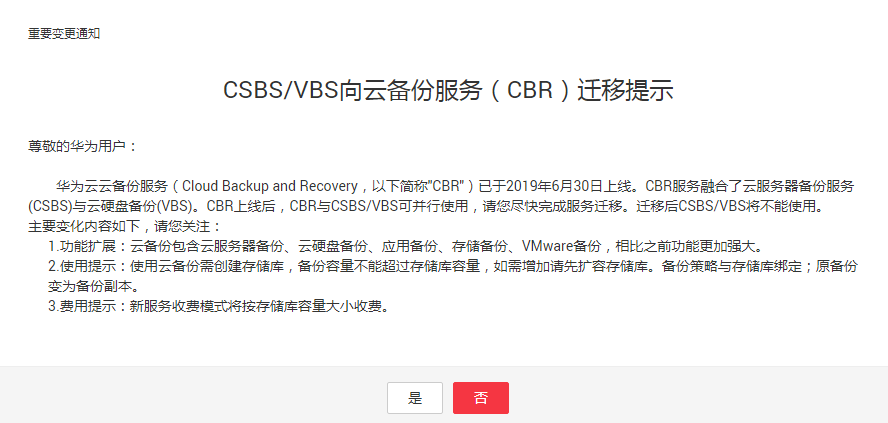

# （可选）迁移资源

## 背景说明

华为云现已上线新版的备份服务云备份。如果您在云服务器备份和云硬盘备份服务中存在备份资源，但希望使用新服务云备份对历史备份进行备份管理，可以将备份资源从云服务器备份和云硬盘备份服务一键迁移至云备份中。

若您从未使用过云服务器备份和云硬盘备份服务或不再需要历史备份资源，可以跳过此章节，直接使用新服务。

完成资源迁移后，您可以根据[退订资源包](https://support.huaweicloud.com/cbr_faq/cbr_06_0028.html)完成云服务器备份和云硬盘备份资源包的退订。

## 迁移规则说明

进行一键迁移时，系统会根据您的历史资源情况为您自动创建存储库。

1.  当服务器或磁盘绑定在备份策略中，并且已产生过备份，无论策略是否开启，则迁移时系统会创建一个与策略名称（最长为64位）相同的存储库，创建成功后策略会绑定存储库。
2.  当服务器或磁盘绑定在策略中，但未产生过备份，则迁移时仅在策略开启的情况下会创建存储库，创建成功后策略会绑定存储库。命名规则同上。
3.  当服务器或磁盘绑定在备份或复制策略中，但未产生过备份，且策略未开启时，仅对策略进行迁移。
4.  当备份或复制策略未绑定服务器或磁盘，迁移时也会对策略进行迁移。
5.  当备份策略开启了数据库备份，创建存储库时会创建一个命名为“default”数据库备份存储库。
6.  复制产生的备份会存放在一个命名为“default”的复制存储库。
7.  手动备份等其他备份单独存放在一个命名为“default”的服务器备份存储库。不同资源会自动创建对应的存储库。如云硬盘备份迁移时，会自动创建云硬盘备份存储库。

根据以上规则，系统在创建存储库时，每个存储库预设容量为：

-   如果磁盘总容量\>备份数据所占容量\*1.2，则取磁盘总容量创建新的存储库。
-   如果磁盘总容量<备份数据所占容量\*1.2，则取备份数据所占容量\*1.2创建新的存储库。

    > **说明：**   
    >磁盘总容量：指将要绑定至该存储库的服务器或磁盘的总容量。  

例如：某用户拥有容量分别为100GB和50GB的云服务器，实际存储数据的容量分别为20GB和10GB，使用云服务器备份服务分别手动创建过一个普通整机备份。进行迁移时，系统会自行比较磁盘总容量和备份数据所占容量\*1.2的大小。本例中备份服务器总容量为150GB，备份数据所占容量\*1.2为36GB。此时系统会自动创建一个大小为150GB的存储库。

## 约束与限制

-   一键迁移时，无法使用已经购买的存储库，系统会自动迁移资源至系统创建的存储库中。
-   系统默认创建的存储库为按需付费模式，若您希望使用包年包月付费模式，请参考[按需转包周期](按需转包周期.md)完成存储库按需转包周期。
-   迁移后，云硬盘备份和云服务器备份将无法使用，新服务云备份将使用新的计费模式进行计费，具体请参考[云备份计费模式](https://support.huaweicloud.com/cbr_faq/cbr_06_0023.html)。

## 操作步骤

1.  登录云备份管理控制台。
    1.  登录管理控制台。
    2.  单击管理控制台左上角的，选择区域和项目。
    3.  单击，选择“存储 \> 云备份”。

2.  选择右上角“迁移至云备份”。阅读弹框提示内容后，单击“是”。如[图1](#fig1730015415381)所示。

    **图 1**  迁移资源  
    

3.  系统会自动将资源进行迁移，迁移成功后会生成一个名为“default”的存储库，并在界面上方提示已迁移成功。

